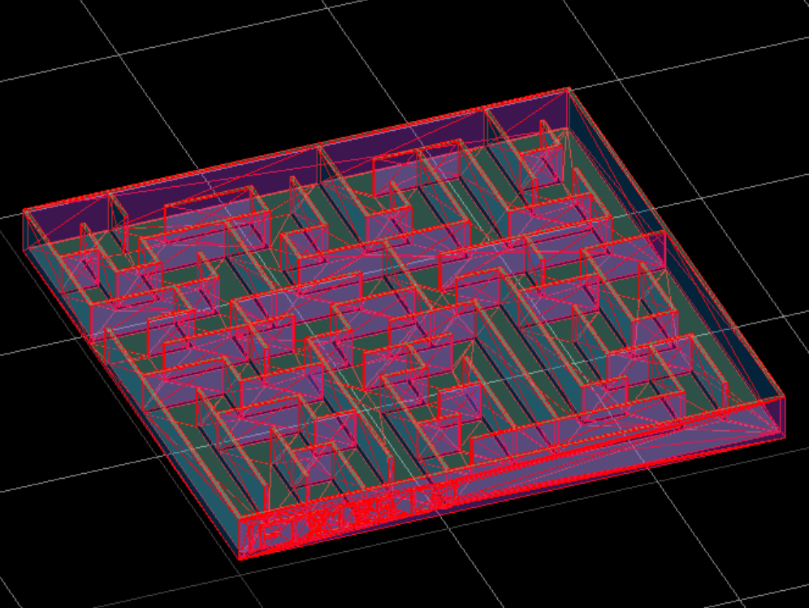

# Maze Generator with Prim's Algorithm

[](https://www.python.org/)
[](https://openscad.org/)

**MazePrim** est un générateur de labyrinthes basé sur **l'algorithme de Prim**.  
Il produit un fichier `.scad` prêt à être visualisé et modifié dans **OpenSCAD**, idéal pour créer des labyrinthes physiques via **impression 3D**.

Le labyrinthe est :
- Unique (un seul chemin sans boucle),
- Complètement parcourable,
- Personnalisé pour être imprimé ou modifié facilement.


#### "Un labyrinthe bien généré est un voyage, pas un piège." 🧩

## 📋 Table des Matières

- [Qu'est-ce que l'algorithme de Prim ?](#-Qu-est-ce-que-l-algorithme-de-Prim-?)
- [Installation et Utilisation](#-Installation-et-Utilisation)
- [Résultat](#-resultat)
- [Impression 3D](#-Impression-3D)

## 🧠 Qu'est-ce que l'algorithme de Prim ?

L'algorithme de Prim est un algorithme classique en informatique utilisé pour construire un arbre couvrant de poids minimal (Minimum Spanning Tree ou MST) dans un graphe pondéré.
Son principe est simple :

- Partir d'un sommet choisi au hasard,

- Étendre progressivement l'arbre en ajoutant à chaque étape l'arête de poids minimal qui relie l'arbre à un sommet non encore visité,

- Répéter jusqu'à ce que tous les sommets soient connectés.

Dans le contexte de la génération de labyrinthes, on adapte Prim : au lieu de minimiser un poids, on choisit simplement des murs à casser aléatoirement pour connecter de nouvelles cellules sans créer de boucle, garantissant un chemin unique.
📈 À quoi sert l'algorithme de Prim ?

L'algorithme de Prim est utilisé dans de nombreux domaines, notamment :

- Conception de réseaux : câblage électrique, réseaux télécoms ou informatiques pour minimiser le coût des connexions.

- Cartographie : trouver des chemins minimaux pour relier des villes, des régions.

- Graphismes et jeux vidéo : génération de labyrinthes, de cartes procédurales sans cycles.

- Robotique et IA : planification de trajets optimisés dans des espaces connectés.

- Modélisation 3D : création de structures connectées avec un minimum de matériaux.


## ⚙️ Installation et Utilisation

### Prérequis

- Python 3.10 ou plus récent
- OpenSCAD (logiciel gratuit de modélisation 3D)

### Lancer la génération

Clonez ce dépôt :

```bash
git clone https://github.com/LylianChallier/MazePrim.git
cd MazePrim
```

Puis lancez simplement le script Python :

```bash
python maze.py
```

Le script crée un fichier `.scad` prêt à être visualisé et modifié dans **OpenSCAD**. Le labyrinthe peut ensuite facilement être imprimé en 3D.

## ✨ Résultat

Voici un exemple de labyrinthe généré :

<p align="center">
  
</p>

## 🖨️ Impression 3D

Pour imprimer votre labyrinthe :

- Générez le .scad avec le script Python.

- Dans OpenSCAD, rendez le modèle (F6) puis exportez-le en .stl.

- Chargez le fichier .stl dans votre logiciel de tranchage préféré (ex: Cura, PrusaSlicer).

- Paramètres recommandés :

    - Hauteur de couche : 0.2 mm

    - Remplissage : 20% (ou plus solide si souhaité)

    - Support : Non nécessaire

- Lancez l'impression !

Le modèle est conçu pour éviter les supports en utilisant des murs verticaux et une base solide.
